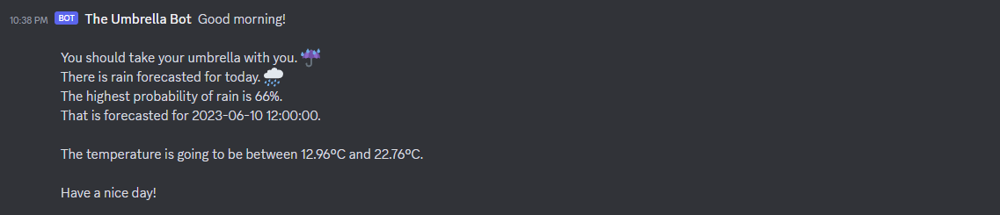

# Genezio - Ultimate Developer Challenge!

[](https://github.com/genez-io/genezio)

Use this template for the genezio challenge at Techsylvania 2023.

# The Umbrella Bot

Reminds you to take your umbrella with you in the morning (if it is going to rain).

## Previous Workflow

Usually, you would check the weather app to see if it is going to rain later in the day when leaving home in the morning.  
But what if you forget to do that exactly on the day when it rains ...

What if you could get this kind of information in your chat app every morning?


## Solution Description

This tool will query a weather API (openweathermap) every morning at 6 AM, check if it is going to rain and then it notifies you using Discord (or other chat platform that you like, but this implementation uses Discord).

The notifications will mention whether or not you should bring an umbrella with you today.  
It will also tell you the minimum and maximum temperature for hat day.  

Use this and never forget your umbrella at home again 🌞


## Deployment

Since this relies on Discord in order to get the information to you, you will have to do some setup before deploying your own Umbrella Bot.  
Don't worry, it's not complicated.  

### Configuring Discord webhooks
- Go to your Discord server, and right click on it and select Server Settings -> Integrations  
- Click on webhooks
- Click on 'New Webhook'
- Click on the newly created webhook, give your Webhook Bot a name and chose a channel.
- Click 'Copy Webhook URL' and paste that value somewhere.

### Get your OpenWeatherMap API key

Go to [https://openweathermap.org/](https://openweathermap.org/) and sign up. You will have to confirm your email and then you'll get your API key quickly.  
After logging in, go to [https://home.openweathermap.org/api_keys](https://home.openweathermap.org/api_keys) and get your API key.

### Preparing your .env file

Create a .env file in this project and populate it with these four values:
```
WEBHOOK_URL=<webhook_url>
LATITUDE=46.821
LONGITUDE=23.582
OWM_API_KEY=<api_key>
```

Replace <webhook_url> with the URL that you copied before (from Discord).  
Replace <api_key> with your API from the last step.  
And replace LATITUDE and LONGITUDE with some coordinates close to your home or to your office.

### Deployment time!

You are now ready to deploy your bot!

This tool is deployed by using [genezio](https://genez.io/).  
You must have the CLI tool installed and you have to be logged in.  
After everything is ready, just run ``` genezio deploy```.

The cronstring ("0 6 * * *") from genezio.yml makes the bot send a message at 6 AM.  
You can change that by replacing the cronstring. Use [https://crontab.guru](https://crontab.guru) as a  reference.

### Local testing

If you want to test your bot locally first, instead of running ``` genezio deploy ```, you can run ``` genezio local```